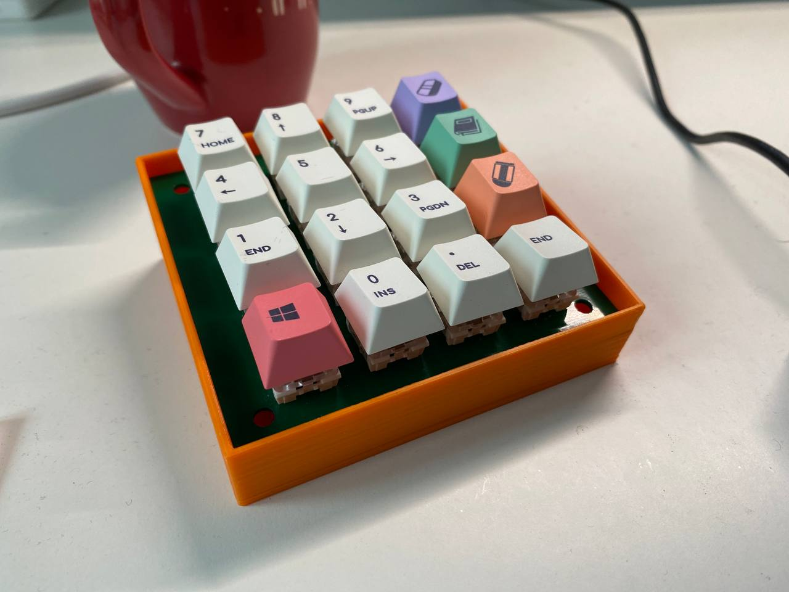
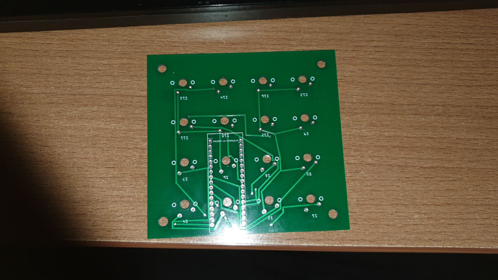
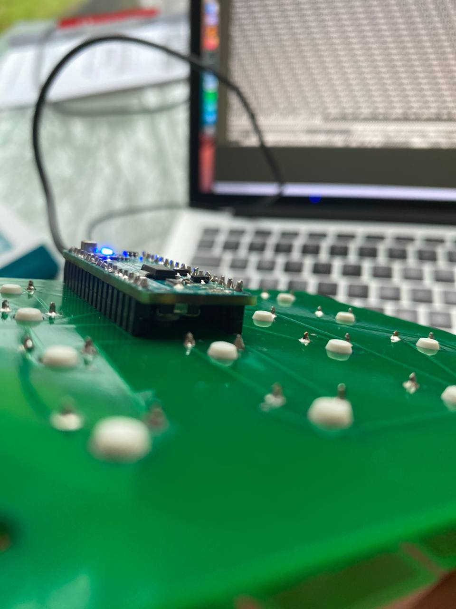
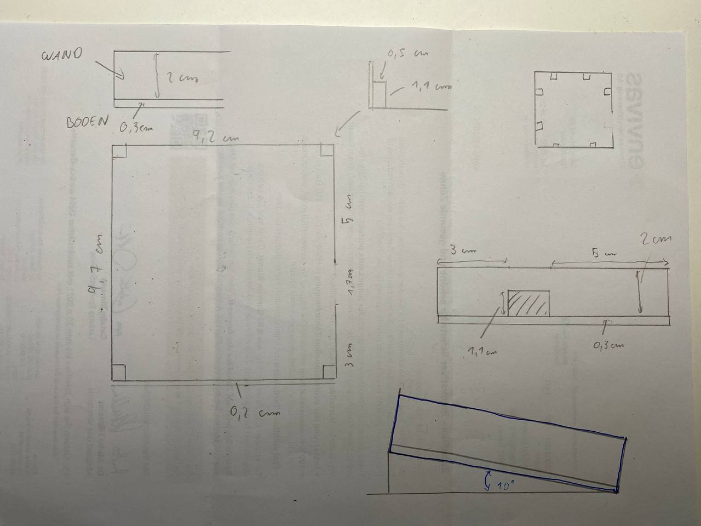
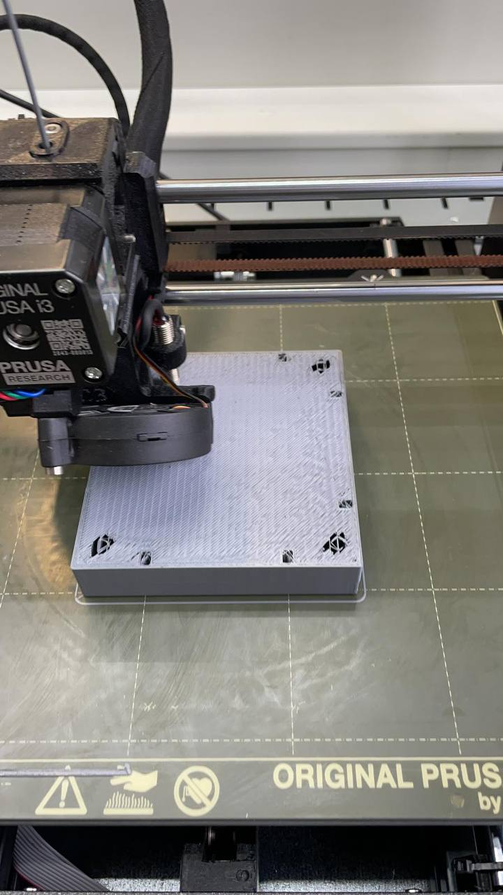
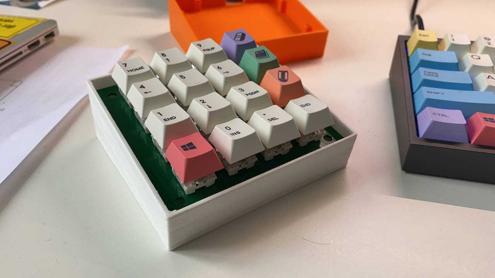

# Arduino Macro Keyboard

This project contains the code for a custom-built macro keyboard powered by an Arduino Micro. The macro keyboard is designed to emulate a standard keyboard, with each key programmed to send specific keypress events when pressed. This can be useful for automating repetitive tasks or creating custom shortcuts.

## Features

- Custom-built macro keyboard with mechanical switches
- Arduino Micro as the controller
- Custom PCB for connecting the switches to the Arduino Micro
- Keycaps for easy identification and use
- USB cable for connecting the macro keyboard to a computer

## Usage

1. Assemble the macro keyboard with the mechanical switches, custom PCB, keycaps, and Arduino Micro. Make sure all connections are secure and accurate.
2. Connect the Arduino Micro to your computer using the USB cable.
3. Open the Arduino IDE, and load the `keyboard_driver.ino` sketch.
4. Select the appropriate board (Arduino Micro) and port from the "Tools" menu in the Arduino IDE.
5. Upload the sketch to the Arduino Micro by clicking the "Upload" button in the IDE.
6. After uploading, the macro keyboard is ready to use. Press the keys on the macro keyboard to send the corresponding keypress events to the connected computer.

## Customization

To customize the key mappings, modify the `buttons` array in the `keyboard_driver.ino` sketch. Change the character associated with each button to the desired key event. For example, to change the key event sent when the first button is pressed, update the following line:

{2, '7', false, 0},

Change the character '7' to the desired key event. Then, upload the modified sketch to the Arduino Micro.

## Journey

1. **PCB Design**: A custom PCB was created to connect the pins of an Arduino Micro to the two pins of 16 key switches.

2. **Soldering**: The Arduino Micro and the switches were soldered onto the PCB.

3. **Case Design**: A custom case was designed to fit the PCB and its components.

4. **3D Printing**: The case was 3D printed using PLA.

5. **Assembly and Programming**: Everything was assembled, and the software was loaded onto the macro keyboard.

## License

MIT License

Copyright (c) 2020 Carl Krogmann

## Author

Carl Krogmann

Built with passion and dedication for custom electronics and automation.
